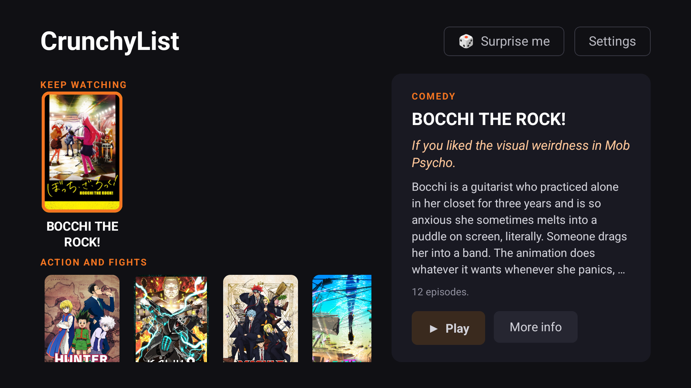
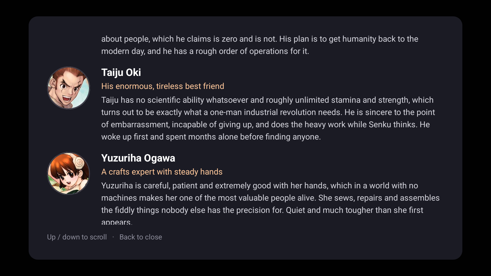

# CrunchyList

A parent-curated, kid-safe front end for [Crunchyroll](https://www.crunchyroll.com). Parents pick exactly which anime series their kids can watch. Everything else is out of reach.

A [Last Gen Labs](https://lastgenlabs.com) project.



## Two front ends

| | |
|---|---|
| **`tv-app/`** | **Google TV / Android TV app.** The active project. Runs on the TV itself — no computer involved. |
| `extension/` | Chrome extension. Works, but only on the laptop it runs on. See [Chrome extension](#chrome-extension) below. |

The extension came first and was abandoned when casting to the TV turned out to be impossible — Crunchyroll removed Chromecast from its web player, and its Widevine DRM blocks the Remote Playback API. The TV app takes a different route: it deep-links into Crunchyroll's own Android app, and enforces the whitelist with a background guard.

Current state and what is next: **[docs/HANDOFF.md](docs/HANDOFF.md)**. See [docs/AUDIT-2026-08.md](docs/AUDIT-2026-08.md) for the full design, every mechanism verified by test, and the traps found along the way.

## The Problem

Crunchyroll's built-in parental controls are one blunt axis — "restrict mature content". That lets through plenty of fan service while blocking things that are perfectly fine. The objection is orthogonal to the dial they give you, so no setting of it works. CrunchyList replaces the dial with an explicit list.

## The Google TV app

**What the kids see:** shelves of approved shows with real poster art — **Keep watching** first, then a shelf per category. Highlighting one shows a write-up of it beside the shelves; selecting it offers **Play** and **More info**. Play opens Crunchyroll straight to that series — with its own resume state intact, so "Continue: E7" still works.

**Keep watching** is built from the app's own launch history — no API, no watch-history permission, nothing to maintain. It matters more than it sounds: Crunchyroll's own Continue-watching row is one of the things the guard bounces, and coming back from an episode recreates the activity, so without it focus reset to the top of the alphabet after every single episode. Now you land back on what you were watching.

**Surprise me**, in the header, picks a show at random and hands focus straight to Play. For when two kids can't agree.

**More info** is a full page on the show: what it is actually about, and a portrait and a paragraph for each main character — who they are, what they can do, what they are like. It exists because deciding what to watch off a wall of poster art is hard, and because knowing a show before starting it is the difference between "no thanks" and "yes" for some kids.



Every word of that is hand-written. Scraped synopses were tried first and were unusable — wiki markup leaked through, the voice changed every entry, and several gave away endings.

**What stops them wandering:** a background guard. Crunchyroll's app can otherwise be opened straight from the TV's app menu, and one Back press from a show lands in the full catalogue. The guard watches which activity is foreground and bounces back to CrunchyList whenever Crunchyroll shows anything that isn't an approved screen.

It needs no AccessibilityService — it reads foreground activity via `UsageStatsManager` and returns to the front using a `SYSTEM_ALERT_WINDOW` background-launch exemption.

**It fails closed.** Anything not positively recognised as an approved screen is bounced. If Crunchyroll renames its activities, CrunchyList becomes unusable rather than permissive — and a **Re-verify** button re-learns the new names by observation.

### Install

Grab the APK from [Releases](https://github.com/super1337coder/CrunchyList/releases), enable unknown sources on the Streamer, and sideload it. Then open CrunchyList → **Settings** and use **Grant usage access** and **Grant overlay access** — both open the real Google TV Settings screens, so no computer is needed once the APK is on the device.

**Without those two permissions the app filters nothing.** It says so in red on the home screen rather than pretending otherwise.

Signing in to Crunchyroll happens on a screen the guard bounces, so there is a way through: **Settings → Let a parent use Crunchyroll** opens a 15-minute window and closes it again on its own. The home screen shows a countdown the whole time it is open.

Set a parent PIN, and you're done: **the app ships with a curated starter list of 29 shows** ([docs/WATCHLIST.md](docs/WATCHLIST.md)) that seeds on first run, so there's nothing to type on a remote. Add or remove shows from Settings; adding takes a Crunchyroll series URL and fetches the title and poster art automatically.

Which shows are on the list is yours — remove one and it stays gone through every update. The write-ups attached to them come from the app, so improving that copy reaches an installed TV.

#### Why it isn't on the Play Store

`SYSTEM_ALERT_WINDOW` is heavily restricted, and an app whose core behaviour is interrupting another app runs straight into Play's Device and Network Abuse policy. Parental control is a recognised exception — but one you apply for and are reviewed as a commercial product, which is disproportionate for something that goes on one TV. `PACKAGE_USAGE_STATS` and `FOREGROUND_SERVICE_SPECIAL_USE` each need their own declared, reviewed use case on top.

<details>
<summary>Building it yourself instead</summary>

```bash
bash tv-app/build.sh assembleDebug
```

```bash
adb install -r tv-app/app/build/outputs/apk/debug/app-debug.apk
```

Granting the permissions over adb, if you'd rather not use the on-screen buttons:

```bash
adb shell appops set com.lastgenlabs.crunchylist GET_USAGE_STATS allow
```

```bash
adb shell appops set com.lastgenlabs.crunchylist SYSTEM_ALERT_WINDOW allow
```

To cut a signed release, put a keystore at `~/.crunchylist/keystore.properties` and run `bash tools/release.sh v0.1.0`.
</details>

### Verifying it actually works

Two suites, because they catch different things.

**Unit tests** — the decision logic (fail-closed rules, calibration safety, URI grammar, ID parsing):

```bash
bash tv-app/build.sh testDebugUnitTest
```

**Behavioural verification** — whether the guard is *really* protecting the device. Unit tests cannot tell you the guard isn't running, isn't allowed to bounce, or didn't survive an update — and every serious bug in this project failed in exactly that way, with the app still reporting itself healthy:

```bash
bash tools/verify-guard.sh
```

It asserts only on observable behaviour and never trusts the app's own status text. Run it after any Crunchyroll update. A failure means the TV is not protected, whatever the screen says.

> **Note:** `tv-app/build.sh` is a wrapper, not decoration — it redirects `TEMP` before starting the JVM. See the Gradle gotcha in the audit if you're curious why.

---

## Chrome extension

> ### ⚠️ Legacy — do not rely on this to filter anything
>
> This is the original laptop-only version, kept for reference. It is **a separate codebase
> that shares no code with the TV app**, and none of the TV app's fixes were applied to it.
>
> The [2026-08 audit](docs/AUDIT-2026-08.md#3-code-audit) found it **fails open in five
> places** — an empty whitelist allows all of Crunchyroll, `/watch/` URLs are never blocked by
> the background script, the content script also fails open, series-ID extraction can approve
> the wrong show via a recommendation link, and the lazy-whitelist state is lost whenever the
> service worker sleeps.
>
> It runs. It does not reliably do what the rest of this section describes. **Use `tv-app/`.**

The sections below document the extension as designed. Read them as intent, not as behaviour.


## How It Works

- **Kids** open Chrome and see a tile grid of parent-approved shows. Clicking a tile goes to that show's Crunchyroll page, stripped down to just the video player and episode list. Everything else (browse, search, recommendations, etc.) is hidden.
- **Parents** manage the approved show list through a PIN-protected settings page. Just paste a Crunchyroll series URL and the extension pulls in the title and poster art automatically.
- **Navigation is locked down.** Any attempt to browse to a non-approved show redirects back to the CrunchyList landing page.

## Install

CrunchyList isn't on the Chrome Web Store yet. Install it manually in developer mode:

1. **Download**: Clone this repo or [download the ZIP](../../archive/refs/heads/main.zip) and unzip it
2. **Open Chrome Extensions**: Navigate to `chrome://extensions/`
3. **Enable Developer Mode**: Toggle the switch in the top right
4. **Load the extension**: Click "Load unpacked" and select the `extension/` folder (not the repo root)
5. **Log into Crunchyroll**: Make sure the Chrome profile is logged into a Crunchyroll account
6. **Set your PIN**: Open the options page (right-click the CrunchyList icon > **Options**, or go to `chrome://extensions`, click the three-dot menu on CrunchyList, and select **Options**). Create a 4-digit PIN
7. **You're ready**: Open a new tab to see the landing page. SPY x FAMILY is included as a starter show. Add more from the options page.

## Setup

### Adding Shows

1. Open the CrunchyList options page: right-click the extension icon and select **Options**, or go to `chrome://extensions`, click the three-dot menu (⋮) on CrunchyList, and select **Options**
2. Enter your 4-digit PIN
3. Paste a Crunchyroll series URL (e.g., `https://www.crunchyroll.com/series/G4PH0WXVJ/spy-x-family`)
4. The title and poster image are fetched automatically
5. Click **Add Show**

### Fetching Images

If you've added shows and they're missing poster art, click the **Fetch All Images** button on the options page to pull artwork from Crunchyroll for every show in your list.

### Removing Shows

On the options page, click the **Remove** button next to any show.

## What Gets Hidden

On approved show pages, CrunchyList hides:
- Navigation bar, search, browse/discover links
- Recommendations ("More Like This") and carousels
- Comments, social/share buttons
- Footer, sidebar, promotional banners
- Account/profile links

What's preserved:
- Video player
- Episode list and season selector
- Watch progress indicators

## How Navigation Enforcement Was Meant To Work

- **Series pages** (`/series/{ID}`): allowed if the series ID is in the whitelist
- **Watch pages** (`/watch/{ID}`): allowed via lazy whitelisting (if the kid navigated from an approved series page) with a fallback check using page metadata
- **Everything else** on crunchyroll.com: redirects to the CrunchyList landing page

**In practice none of the three holds reliably** — see the warning at the top of this section.
Series pages are the only case that works as written, and only while the whitelist is
non-empty.

The extension also only controls `crunchyroll.com`. It cannot block other websites. For a fully locked-down experience, see [Browser Hardening](#browser-hardening) below.

## Browser Hardening

For a more locked-down kids' Chrome profile, configure these via Chrome enterprise policies:

- Force-install the CrunchyList extension (prevents removal)
- Disable Chrome developer tools
- Disable incognito mode
- Use Chrome's site allowlist to restrict browsing to `crunchyroll.com` only

This is optional and outside the extension itself. See the [Chrome Enterprise policy docs](https://chromeenterprise.google/policies/) for details.

## Technical Details

- **Manifest V3** Chrome extension
- **No build step, no bundler, no dependencies.** Pure vanilla JS/HTML/CSS
- **Storage**: Whitelist metadata in `chrome.storage.sync` (syncs across devices), images and PIN hash in `chrome.storage.local`
- **Content hiding**: CSS injection at `document_start` (no flicker) + DOM cleanup via MutationObserver at `document_idle`
- **Image fetching**: Uses Crunchyroll's public CMS API to pull poster art

---

## Project structure

Two independent front ends. They share no code — only the product idea and the shape of a
whitelist record.

```
CrunchyList/
├── tv-app/                     # THE PRODUCT — Google TV app (Kotlin, Compose for TV)
│   ├── build.sh                #   build wrapper (redirects TEMP; see audit §6)
│   └── app/src/main/
│       ├── assets/default_whitelist.json   # curated starter list, seeds on first run
│       └── java/com/lastgenlabs/crunchylist/
│           ├── guard/          #   the part that makes this a parental control
│           │   ├── GuardService.kt        foreground watcher + bounce
│           │   ├── ScreenClassifier.kt    allow / bounce / ignore  (pure, tested)
│           │   ├── SessionOrigin.kt       did CrunchyList start this session?
│           │   ├── CalibrationRules.kt    what may be learned      (pure, tested)
│           │   └── GuardCalibrator.kt     re-learns CR's screens by observation
│           ├── crunchyroll/    #   deep links + CMS API
│           ├── data/           #   whitelist storage
│           │   ├── SeedMerge.kt            membership is yours, text is the app's (pure, tested)
│           │   ├── Shelves.kt              Keep watching, then a shelf per category (pure, tested)
│           │   └── RecentlyPlayed.kt       what's been watched, from our own launches
│           ├── settings/       #   PIN-gated parent screen
│           └── ui/             #   shelves, detail panel, More Info
│
├── extension/                  # LEGACY Chrome extension — see warning above
│
├── tools/
│   ├── verify-guard.sh         # behavioural checks against a real device
│   ├── fetch-show.ps1          # art, facts and cast portraits for a new show
│   ├── probe-deeplinks.ps1     # re-derive the crunchyroll:// grammar
│   └── probe-usagestats/       # guard feasibility probe (Gradle-free)
│
└── docs/
    ├── AUDIT-2026-08.md        # design, every verified mechanism, every trap
    ├── WATCHLIST.md            # the bundled list and what isn't on Crunchyroll
    └── CRUNCHYLIST-REQUIREMENTS.md   # original spec (casting workflow now dead)
```

## License

MIT
